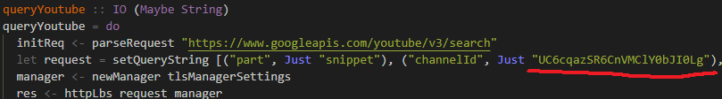
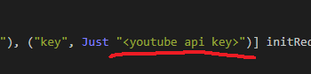
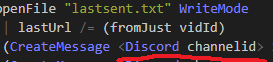
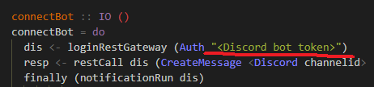

# Discord Bot with the power of Haskell #

Simple youtube notification bot from one selected channel written in haskell with the use of discord-haskell library.

Libraries used to create this:
* **discord-haskell** 
* **http-conduit** (https - queries)
* **Aeson** (JSON parsing)

### Run the bot ###
So, you install all these libraries (Hello, caball-hell) and want to run this bot for fun.
First of all, you need:
* Create application at https://discordapp.com/developers/applications/.
* Add a bot in bot menu and grab the **TOKEN ID**.
* Use the "Bot permissions" tab to calculate permissions and grab the **CLIENT ID** of your bot from the "general information" tab.
* Invite the bot to a server, copy & paste this link into your web browser `https://discordapp.com/oauth2/authorize?client_id=<CLIENT_ID>&scope=bot&permissions=<PERMISSIONS>` and replace <sample text> with your data from previous step.

Secondly, simply follow the instructions and get your **Youtube API Key**: https://developers.google.com/youtube/v3/getting-started

Next, you need to format `bot.hs` file with your tokens, IDs, etc.

* Replace channelId value.

 

* Paste your **Youtube API Key** here.

 
  
*  In such cases paste Discord **CHANNEL ID**.

 .
 
* Your bot token

 .

**I'M TOO LAZY TO KEEP THESE IDS IN SEPARATE PLACE FOR CONVENIENCE!**

To get Discord **CHANNEL ID** enable **Developer Mode** in Discord Settings, click right-click on chat channel you want and click **copy id**.

Finally, run **ghci** and load hs file (`:l bot.hs`), then start the function **connectBot**
